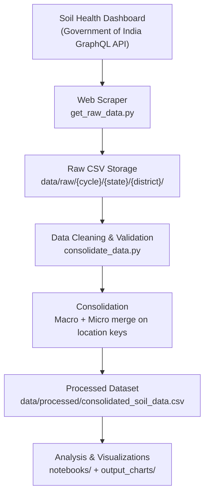

# Soil Health Data Pipeline

A modular, extensible data engineering pipeline for scraping, consolidating, and analyzing India's Soil Health Card nutrient data from the Government of India's Soil Health Dashboard.

Originally developed as part of a data engineering assessment, this project is structured as a production-ready pipeline designed for long-term maintenance and growth.

---


## Table of Contents

1. [Project Overview](#project-overview)
2. [Features](#features)
3. [Repository Structure](#repository-structure)
4. [Data Pipeline](#data-pipeline)
5. [Installation](#installation)
6. [Usage](#usage)
7. [Data Storage](#data-storage)
8. [Scalability](#scalability)
9. [Error Handling](#error-handling)
10. [Analysis](#analysis)
11. [Tech Stack](#tech-stack)
12. [Future Improvements](#future-improvements)
13. [Development Guide](#development-guide)
14. [License](#license)

---

## Project Overview

### Problem

India's agricultural policy depends on timely, accurate soil nutrient data at the village level. The Government of India's Soil Health Dashboard publishes this data via a GraphQL API, but it is fragmented across states, districts, blocks, and cycles — making it difficult for analysts, researchers, and policymakers to access a unified dataset.

### Why Soil Nutrient Data Matters

Soil health directly determines crop yield, food security, and sustainable farming practices. Key metrics — macronutrients (Nitrogen, Phosphorus, Potassium), micronutrients (Zinc, Iron, Copper, Boron, Manganese), soil pH, organic carbon, and electrical conductivity — reveal deficiencies that guide fertilizer subsidies, land management programs, and regional agricultural planning.

### Pipeline Overview

The pipeline follows a standard extract-transform-load (ETL) pattern:

| Stage | Description |
|-------|-------------|
| **Extract** | Scrapes village-level nutrient data from the Soil Health Dashboard GraphQL API |
| **Store** | Persists raw CSV files in a hierarchical directory structure organized by cycle, state, district, and block |
| **Transform** | Cleans, standardizes, and merges macro and micronutrient datasets |
| **Load** | Outputs a single consolidated CSV for downstream analysis |
| **Analyze** | Jupyter notebooks generate statistical insights and publication-quality charts |

---

## Features

### Implemented

| Feature | Status | Description |
|---------|--------|-------------|
| Automated web scraping | ✅ | GraphQL API client with pagination across states, districts, and blocks |
| Hierarchical data collection | ✅ | Data stored as `Cycle/State/District/Block_{macro,micro}.csv` |
| Data validation | ✅ | Allowlist-based column filtering, empty dataset handling, null filling |
| Data consolidation | ✅ | Merges macro and micro datasets on location keys with outer join |
| Exploratory analysis | ✅ | Jupyter notebook with 8 analytical sections |
| Visualization | ✅ | 5 charts covering NPK distribution, micronutrient heatmaps, pH vs. OC, salinity, and co-deficiency correlations |
| Checkpointing | ✅ | Scraper skips already-downloaded files, enabling resume after interruption |
| Logging | ✅ | Dual logging to console and `scraper.log` file with timestamps and severity levels |
| Retry with backoff | ✅ | Exponential backoff with jitter on network failures (up to 3 retries) |
| Graceful shutdown | ✅ | Handles `KeyboardInterrupt` and unexpected exceptions with clean exit codes |

### Extensible / Planned

| Feature | Description |
|---------|-------------|
| Incremental scraping | Only fetch data for new cycles or updated blocks |
| Parallel scraping | Concurrent requests across states or blocks to reduce total runtime |
| Database backend | Store raw and processed data in PostgreSQL or DuckDB for queryability |
| CLI interface | Subcommand-based CLI for scraper, consolidator, and analyzer |
| Scheduled execution | Airflow DAG or cron-based pipeline orchestration |
| Docker support | Containerized pipeline for reproducible deployments |
| Cloud storage | S3/GCS-compatible raw data lake for centralized access |
| Automated reporting | Scheduled generation of PDF or HTML reports from analysis notebooks |

---

## Repository Structure

```
soil-health-pipeline/
├── get_raw_data.py              # Web scraper: extracts nutrient data from the Soil Health Dashboard API
├── consolidate_data.py          # ETL script: cleans, merges, and consolidates raw CSVs
├── requirements.txt             # Python dependencies
├── scraper.log                  # Scraper execution log (gitignored)
├── .gitignore                   # Excludes venv, caches, logs, and notebook checkpoints
├── README.md                    # This file
│
├── data/
│   ├── raw/                     # Raw scraped CSV files (hierarchical by cycle → state → district)
│   │   ├── 2023-24/
│   │   │   └── <State>/
│   │   │       └── <District>/
│   │   │           └── <Block>_{macro,micro}.csv
│   │   └── 2024-25/
│   │       └── ...
│   └── processed/               # Consolidated output dataset
│       └── consolidated_soil_data.csv
│
├── notebooks/                   # Jupyter notebooks for EDA and analysis
│   └── Soil_Health_Analysis.ipynb
│
└── output_charts/               # Generated visualization figures
    ├── deficiency_correlation.png
    ├── micronutrient_heatmap.png
    ├── npk_distribution.png
    ├── oc_vs_ph.png
    └── top_saline_districts.png
```

### File Descriptions

| File / Directory | Purpose |
|------------------|---------|
| `get_raw_data.py` | Scrapes the Soil Health Dashboard GraphQL API. Fetches states → districts → blocks → nutrient data for each cycle and scheme. Saves raw CSVs under `data/raw/`. |
| `consolidate_data.py` | Reads all raw macro and micro CSVs, applies an allowlist filter, standardizes column names, cleans string fields, fills nulls, and merges macro + micro into a single consolidated CSV. |
| `notebooks/` | Contains Jupyter notebooks for exploratory data analysis. Each notebook is self-contained with its own data ingestion, transformation, and visualization cells. |
| `data/raw/` | Immutable raw data store. Organized by cycle, state, district, and block. New data is appended here without modifying existing files. |
| `data/processed/` | Output of the consolidation step. Contains the single consolidated CSV used for analysis. |
| `output_charts/` | PNG figures generated by analysis notebooks. Referenced in the notebook narrative and useful for standalone reporting. |
| `scraper.log` | Append-only log of scraper runs. Includes timestamps, severity levels, and per-file status (SAVED / SKIP / EMPTY / ERROR). |
| `.gitignore` | Excludes virtual environments, Python caches, Jupyter checkpoints, log files, and IDE-specific directories. |

---

## Data Pipeline

The following Mermaid diagram illustrates the end-to-end data flow:



### Pipeline Stages in Detail

1. **Scrape** — The scraper queries the GraphQL API for all states, then recursively fetches districts, blocks, and nutrient data for each cycle and scheme (macro/micro).
2. **Store Raw** — Each block's nutrient data is saved as a CSV file named `<Block>_{macro,micro}.csv` under the appropriate cycle/state/district path. Existing files are skipped (checkpointing).
3. **Clean** — The consolidation script reads all raw CSVs, keeps only location keys and `results_*` columns, strips the `results_` prefix, converts to title case, and fills numeric nulls with 0.
4. **Merge** — Macro and micro datasets are outer-joined on location keys (`cycle`, `state_name`, `district_name`, `block_name`, `village_name`). Duplicate columns from the merge are dropped.
5. **Analyze** — The consolidated CSV is loaded into a Jupyter notebook for feature engineering, statistical analysis, and chart generation.

---

## Installation

### Prerequisites

- **Python** 3.10 or later (tested with 3.13)
- **pip** package manager

### Setup

```bash
# 1. Clone the repository
git clone <repository-url>
cd soil-health-pipeline

# 2. Create a virtual environment
python3 -m venv .venv

# 3. Activate the virtual environment
# Linux / macOS:
source .venv/bin/activate
# Windows:
.venv\Scripts\activate

# 4. Install dependencies
pip install -r requirements.txt
```

### Dependency Summary

| Package | Purpose |
|---------|---------|
| `requests` | HTTP client for GraphQL API calls |
| `pandas` | Data manipulation and CSV I/O |
| `tabulate` | Pretty-printing DataFrames in console output |
| `ipykernel` | Jupyter notebook kernel |
| `matplotlib` | Static chart generation |
| `seaborn` | Statistical visualizations |

---

## Usage

### Run the Scraper

Fetches all available nutrient data from the Soil Health Dashboard and stores raw CSVs in `data/raw/`:

```bash
python get_raw_data.py
```

The scraper automatically:
- Discovers all states from the API
- Recursively fetches districts and blocks
- Downloads macro and micro nutrient data for each configured cycle
- Skips files that already exist (checkpointing)
- Logs progress to both console and `scraper.log`

### Run the Consolidation Script

Cleans and merges all raw CSVs into a single consolidated dataset:

```bash
python consolidate_data.py
```

Output is written to `data/processed/consolidated_soil_data.csv`.

### Run the Analysis Notebook

Launch Jupyter and open the analysis notebook:

```bash
jupyter notebook notebooks/Soil_Health_Analysis.ipynb
```

Or use JupyterLab:

```bash
jupyter lab notebooks/Soil_Health_Analysis.ipynb
```

The notebook reads from `../data/processed/consolidated_soil_data.csv` and generates charts saved to `../output_charts/`.

### Quick Pipeline Run (All Steps)

```bash
python get_raw_data.py && python consolidate_data.py
```

---

## Data Storage

### Directory Hierarchy

Raw data is stored using a four-level hierarchy:

```
data/raw/
└── {cycle}/              # e.g., 2023-24, 2024-25
    └── {state}/          # e.g., ANDHRA PRADESH, ANDAMAN & NICOBAR
        └── {district}/   # e.g., ANANTAPUR, Alluri Sitharama Raju
            └── {block}_{nutrient_type}.csv
```

### Why This Structure?

| Design Decision | Rationale |
|-----------------|-----------|
| Cycle as top-level key | Enables easy comparison across agricultural seasons; old data is never overwritten |
| State as second-level key | Mirrors India's administrative hierarchy; allows state-level filtering without parsing filenames |
| District as third-level key | Provides granular geographic indexing for district-level analysis |
| `{block}_{type}.csv` naming | Descriptive filenames that encode both location and nutrient category; no parsing ambiguity |
| Flat CSV files per block | Simple, portable, and version-control friendly; each file is independently re-scrapable |

### Data Schema (Consolidated)

The consolidated dataset (`consolidated_soil_data.csv`) contains 34 columns:

| Column Group | Columns |
|-------------|---------|
| **Location Keys** | `cycle`, `state_name`, `district_name`, `block_name`, `village_name` |
| **Macronutrients** | `N_High`, `N_Low`, `N_Medium`, `P_High`, `P_Low`, `P_Medium`, `K_High`, `K_Low`, `K_Medium` |
| **Sulphur** | `S_Sufficient`, `S_Deficient` |
| **Organic Carbon** | `OC_High`, `OC_Low`, `OC_Medium` |
| **pH** | `PH_Alkaline`, `PH_Acidic`, `PH_Neutral` |
| **Electrical Conductivity** | `EC_Saline`, `EC_NonSaline` |
| **Micronutrients** | `Fe_Sufficient`, `Fe_Deficient`, `Zn_Sufficient`, `Zn_Deficient`, `Cu_Sufficient`, `Cu_Deficient`, `B_Sufficient`, `B_Deficient`, `Mn_Sufficient`, `Mn_Deficient` |

---

## Scalability

The architecture is designed so that new data sources, years, and nutrient types can be added without modifying the core pipeline.

### Adding a New Year/Cycle

1. Add the cycle name (e.g., `"2025-26"`) to the `CYCLES` list in `get_raw_data.py`
2. Run the scraper — it will create `data/raw/2025-26/` automatically
3. The consolidation script picks up all cycles via `rglob`, so no changes are needed

### Adding a New Nutrient Type

1. Add a new entry to the `SCHEMES` dict in `get_raw_data.py` with the scheme ID
2. The scraper will automatically fetch and store files with the new nutrient type suffix
3. The consolidation script's allowlist approach (`results_*` columns) will pick up new columns without code changes

### Adding a New State or District

No code changes are required. The scraper discovers states dynamically from the API and creates the corresponding directory structure automatically.

### Adding a New Scraper Module

To add a completely new data source (e.g., a different government portal):

1. Create a new script (e.g., `scrape_weather.py`) following the same patterns:
   - Use `logging` for all output
   - Save raw data under `data/raw/{cycle}/` with a consistent naming convention
   - Include checkpointing (skip existing files)
2. Add the new script to `requirements.txt` if it introduces new dependencies
3. Extend `consolidate_data.py` to handle the new file pattern if needed

---

## Error Handling

The scraper implements several robustness mechanisms:

| Mechanism | Implementation |
|-----------|---------------|
| **Retry with exponential backoff** | `fetch_graphql()` retries failed requests up to 3 times with increasing wait times (2s + random jitter) |
| **Logging** | Dual output to console and `scraper.log` with `INFO`, `WARNING`, `ERROR`, and `CRITICAL` levels |
| **Checkpointing** | Before each download, the scraper checks if the target file already exists and skips it |
| **Empty dataset handling** | Blocks with no data are logged at `DEBUG` level and skipped without error |
| **Keyboard interrupt** | `KeyboardInterrupt` is caught gracefully, logged, and exits with code 0 |
| **Fatal error handling** | Unexpected exceptions are logged with full traceback (`exc_info=True`) and exit with code 1 |
| **Input validation** | The consolidation script checks for missing directories and empty datasets before processing |
| **Null safety** | All numeric columns in the consolidated output are filled with 0 to prevent downstream analysis failures |

---

## Analysis

The analysis notebook (`notebooks/Soil_Health_Analysis.ipynb`) generates the following insights and charts:

### Analytical Sections

| Section | Focus | Output Chart |
|---------|-------|-------------|
| 1. Data Ingestion & Validation | Shape, completeness, data types of consolidated dataset | — |
| 2. Feature Engineering | Normalizes raw test counts to percentages for cross-village comparability | — |
| 3. NPK Profile | Aggregates Nitrogen, Phosphorus, Potassium distribution across all regions | `npk_distribution.png` |
| 4. Micronutrient Heatmap | Identifies regional vulnerabilities in Zn, Fe, Cu, B, Mn deficiency | `micronutrient_heatmap.png` |
| 5. Organic Carbon vs. pH | Examines relationship between soil pH and organic carbon retention | `oc_vs_ph.png` |
| 6. Co-Deficiency Correlation | Pearson correlation matrix of nutrient deficiency percentages | `deficiency_correlation.png` |
| 7. Salinity Crisis | Top 10 districts with highest proportion of saline soil samples | `top_saline_districts.png` |
| 8. Executive Summary | Strategic takeaways and policy recommendations | — |

### Key Insights (from current data)

- **Nitrogen deficiency** is a dominant concern across sampled regions, indicating heavy reliance on urea-based fertilizers
- **Micronutrient vulnerabilities** (particularly Zinc and Iron) show strong regional clustering, suggesting targeted subsidy programs would be effective
- **Extreme pH levels** (highly acidic or alkaline soils) correlate with lower organic carbon retention
- **Salinity** is concentrated in specific districts, pointing to irrigation-related soil degradation

Charts are saved to `output_charts/` and can be used standalone in reports or presentations.

---

## Tech Stack

| Component | Technology | Version (inferred) |
|-----------|-----------|-------------------|
| **Language** | Python | 3.13.x |
| **HTTP Client** | `requests` | Latest stable |
| **Data Processing** | `pandas` | Latest stable |
| **Visualization** | `matplotlib`, `seaborn` | Latest stable |
| **Table Display** | `tabulate` | Latest stable |
| **Notebook Runtime** | `ipykernel` | Latest stable |
| **API Protocol** | GraphQL | — |
| **Data Format** | CSV | — |
| **Notebook Format** | Jupyter Notebook (`.ipynb`) | — |
| **Environment** | `venv` (virtual environment) | — |
| **Version Control** | Git | — |

---

## Future Improvements

The following enhancements are planned or envisioned for future iterations:

### Data Acquisition
- **Incremental scraping** — Track last-fetched timestamps and only download new or updated blocks
- **Parallel scraping** — Use `concurrent.futures` or `asyncio` to fetch multiple states/blocks concurrently, reducing total runtime
- **Rate limit adaptation** — Dynamically adjust request intervals based on API response headers

### Data Storage
- **Database backend** — Store raw and processed data in PostgreSQL or DuckDB for SQL-based querying and better scalability
- **Data versioning** — Use DVC (Data Version Control) to track changes in raw datasets across cycles
- **Cloud storage** — Sync `data/raw/` to S3 or GCS for centralized access and backup

### Pipeline Orchestration
- **CLI interface** — `click` or `argparse`-based CLI with subcommands (`scrape`, `consolidate`, `analyze`)
- **Airflow scheduling** — DAG-based pipeline with automated retries, SLAs, and alerting
- **Docker support** — Containerized pipeline for reproducible deployments and CI/CD integration

### Analysis & Reporting
- **Automated reporting** — Generate PDF or HTML reports from notebooks on a schedule
- **Incremental analysis** — Only re-analyze data that has changed since the last run
- **Dashboard** — Streamlit or Gradio web app for interactive exploration of soil health data

### Code Quality
- **Type hints** — Add static typing to all functions for better IDE support and error detection
- **Unit tests** — pytest-based tests for scraper, consolidator, and data validation logic
- **CI/CD** — GitHub Actions pipeline for linting, testing, and automated notebook execution

---

## Development Guide

This guide is for data engineers who want to extend the pipeline with new scrapers, processing scripts, or analysis notebooks.

### Adding a New Scraper

1. Create a new Python file (e.g., `scrape_weather.py`) in the repository root
2. Follow the existing patterns:
   - Use `logging` (not `print`) for all operational output
   - Save raw data under `data/raw/{cycle}/` using the hierarchical directory structure
   - Include checkpointing: check if output file exists before scraping
   - Handle network errors with retry logic and exponential backoff
   - Use `sanitize_name()` or equivalent to ensure safe directory/file names
3. Add any new dependencies to `requirements.txt`
4. Document the scraper's purpose, data source, and output schema in this README

### Adding a New Processing Script

1. Create a new Python file (e.g., `enrich_data.py`) in the repository root
2. Read from `data/raw/` or `data/processed/` as appropriate
3. Write output to `data/processed/` with a descriptive filename
4. Use the same logging pattern as `consolidate_data.py`
5. If the script produces a new consolidated file, update the notebook's data path reference

### Adding a New Analysis Notebook

1. Create a new `.ipynb` file in `notebooks/` (e.g., `Seasonal_Trends_Analysis.ipynb`)
2. Use relative paths (`../data/processed/`, `../output_charts/`) for data access and chart output
3. Structure the notebook with markdown headers for each analytical section
4. Save all generated charts to `output_charts/` with descriptive filenames
5. Reference the notebook in this README's analysis section

### Maintaining the Project Structure

- **Never modify files in `data/raw/`** — Raw data is immutable. Re-scrape if corrections are needed.
- **Keep `data/processed/` as the single source of truth** for downstream analysis — only one consolidated file should exist at a time.
- **Commit only source code and documentation** — `data/`, `.venv/`, `scraper.log`, and `output_charts/` should be gitignored or treated as artifacts.
- **Follow the naming convention** `<Block>_{macro,micro}.csv` for raw files to ensure the consolidation script can discover them via `rglob`.
- **Update `requirements.txt`** whenever a new dependency is introduced.

---

## License

This project is licensed under the [MIT License](LICENSE).

---

*Soil Health Data Pipeline — Scraping, consolidating, and analyzing India's village-level soil nutrient data from the Government of India's Soil Health Dashboard.*